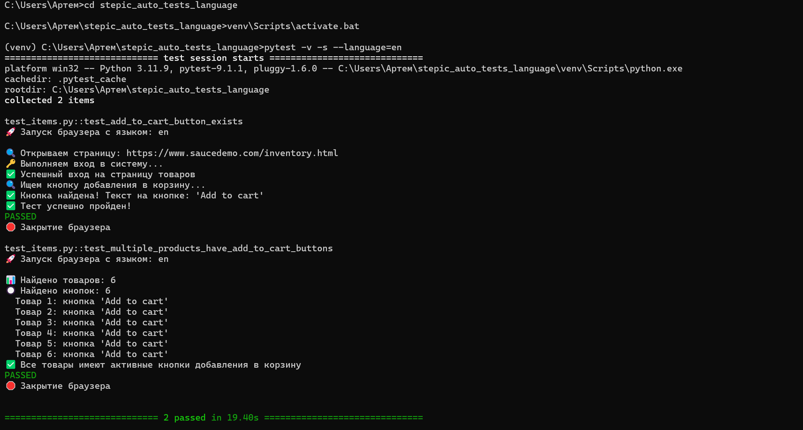

# stepic_auto_tests_language
# Автотесты для интернет-магазина с поддержкой разных языков

## Описание
Проект содержит автотесты, проверяющие наличие кнопки добавления в корзину на странице товара. 
Тесты могут запускаться с разными языковыми настройками браузера.

## Установка
```bash
pip install -r requirements.txt

## Запуск тестов

pytest -v -s --language=en

## Скриншоты


